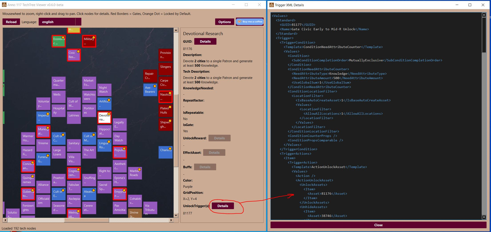

# Anno 117 TechTree Viewer

A specialized viewer for the tech trees of **Anno 117**. This tool allows for the visual processing and examination of complex dependencies and data structures in the `assets.xml`.

## Features

*   **Visual Representation:** Graphical processing of tech nodes based on game data.
*   **XML Deep-Dive:** Display of detailed information on GUIDs, descriptions, costs, and rewards.
*   **Raw Data Viewer:** Integrated XML syntax highlighter to view original data directly in the app.
*   **Flexible Configuration:** Customizable offsets and staggering logic for various categories (Economy, Military, Civic etc.) to optimize the layout.
*   **Localization:** Support for `texts_*.xml` files to display correct in-game names and descriptions.
*   **Interactive UI:** Zooming, panning, and selection feedback for fluid navigation through large trees.

## Usage

1.  **Configure Path:** Use the **Options** button to select the root directory where you exported the game files (e.g., using RDA Explorer). Alternatively, you can check the **"Use internal Files (Patch v1.5.1)"** box to use pre-packaged game data. The tool searches recursively for `assets.xml` and the localization files (`texts_*.xml`), so selecting the top-level extraction folder is sufficient.
2.  **Navigation:**
    *   **Mouse wheel:** Zoom (focuses on mouse position).
    *   **Right-click + Drag:** Pan the view.
    *   **Left-click:** Select a node for detailed information in the right panel.
3.  **Details:** In the detail panel, use the "Details" buttons to view corresponding XML snippets for triggers, rewards, or buffs.

## Support

If this tool helps you, I would appreciate a coffee!

 

---
*Note: This is a fan project and is not affiliated with Ubisoft.*

# Anno 117 TechTree Viewer (Deutsch)

Ein spezialisierter Viewer für die Technologiebäume von **Anno 117**. Dieses Tool ermöglicht die visuelle Aufbereitung und Untersuchung komplexer Abhängigkeiten und Datenstrukturen in der `assets.xml`.

## Features

*   **Visuelle Darstellung:** Grafische Aufbereitung der Technologie-Knoten basierend auf Spieldaten.
*   **XML Detailansicht:** Anzeige detaillierter Informationen zu GUIDs, Beschreibungen, Kosten und Belohnungen.
*   **Rohdaten-Viewer:** Integrierter XML-Syntax-Highlighter, um Originaldaten direkt in der App zu betrachten.
*   **Flexible Konfiguration:** Anpassbare Offsets und Staggering-Logik für verschiedene Kategorien (Wirtschaft, Militär, Zivil etc.), um das Layout zu optimieren.
*   **Lokalisierung:** Unterstützung für `texts_*.xml`-Dateien zur Anzeige der korrekten In-Game-Namen und Beschreibungen.
*   **Interaktive Benutzeroberfläche:** Zoomen, Verschieben und Auswahl-Feedback für eine flüssige Navigation durch große Bäume.

## Bedienung

1.  **Pfad konfigurieren:** Nutze den **Options**-Button, um das Stammverzeichnis auszuwählen, in das du die Spieldateien exportiert hast (z. B. mit dem RDA Explorer). Alternativ kannst du die Checkbox **"Use internal Files (Patch v1.5.1)"** aktivieren, um die im Programm enthaltenen Spieldaten zu nutzen. Das Tool sucht rekursiv nach der `assets.xml` und den Lokalisierungsdateien (`texts_*.xml`), sodass die Auswahl des obersten Extraktionsordners ausreicht.
2.  **Navigation:**
    *   **Mausrad:** Zoomen (fokussiert auf die Mausposition).
    *   **Rechtsklick + Ziehen:** Ansicht verschieben.
    *   **Linksklick:** Einen Knoten auswählen, um Details im rechten Panel anzuzeigen.
3.  **Details:** Nutze im Detail-Panel die "Details"-Buttons, um die entsprechenden XML-Ausschnitte für Trigger, Belohnungen oder Buffs anzuzeigen.

## Support

Wenn dir dieses Tool hilft, freue ich mich über einen Kaffee!

 

---
*Hinweis: Dies ist ein Fan-Projekt und steht in keiner Verbindung zu Ubisoft.*